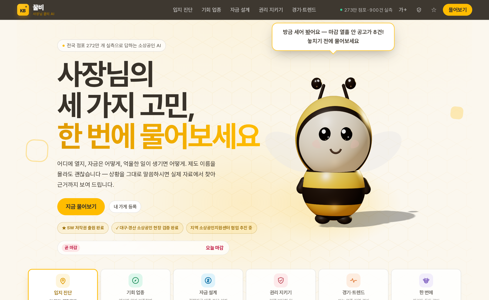
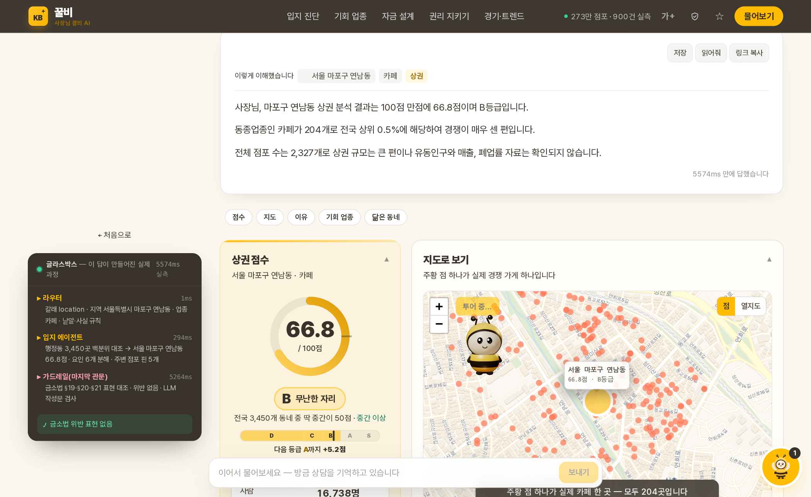
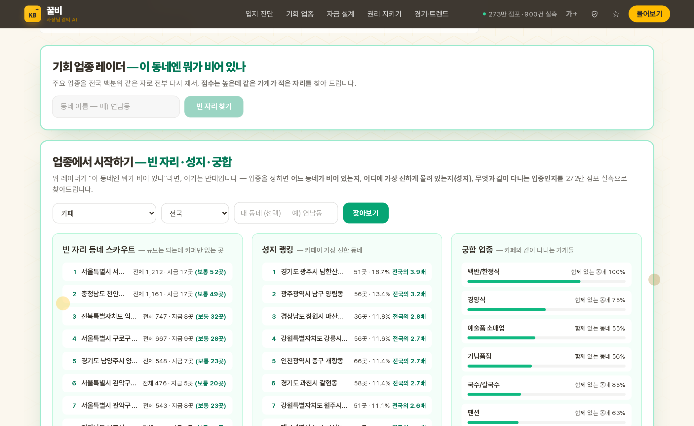
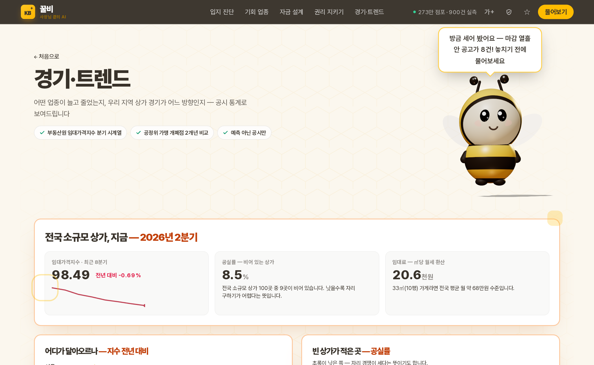
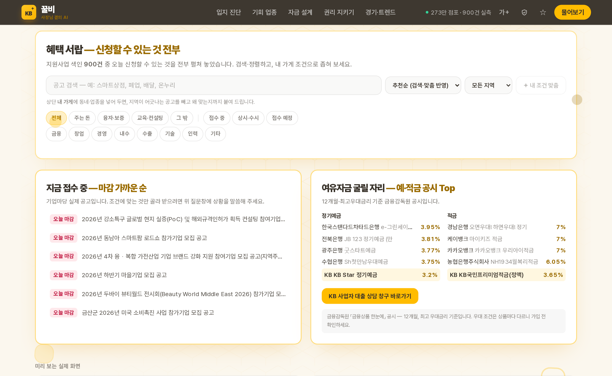

# 꿀비 — 사장님 곁의 AI 비서

**제8회 KB AI Challenge** · 소상공인 멀티에이전트 상담 플랫폼
Pick 2 최적 입지 × Pick 3 소상공인 금융 × Pick 4 소비자 보호

**▶ 실서비스: https://kb-kkulbee-smallbiz-multiagent.onrender.com** · [3분 시연 가이드](docs/심사위원_시연_가이드.md)
(무료 서버라 첫 접속은 깨우는 데 수십 초 걸릴 수 있습니다 —
[시연 딥링크](https://kb-kkulbee-smallbiz-multiagent.onrender.com/?q=연남동에서%20카페%20열려는데%20상권%20어때%3F)로 바로 질문이 실행됩니다)

<p align="center">
  
</p>

<table>
  <tr>
    <td width="50%">
      
      <p align="center"><b>지도 투어</b> — 작은 꿀비가 직접 날며 해설 · 열지도 · 클릭하면 주변 실제 가게</p>
    </td>
    <td width="50%">
      
      <p align="center"><b>기회 업종</b> — 빈 자리 동네 역탐색 · 성지 랭킹 · 궁합 업종</p>
    </td>
  </tr>
  <tr>
    <td width="50%">
      
      <p align="center"><b>경기·트렌드</b> — 임대가격지수·공실률·임대료, 전부 공시 통계</p>
    </td>
    <td width="50%">
      
      <p align="center"><b>자금 설계</b> — 실공고 조달 설계 · 마감 임박 공고 · 예적금 공시 · KB 창구</p>
    </td>
  </tr>
</table>

> "요즘 통 손님이 없어서 월세도 빠듯해요" — 이 문장에는 '자금'도 '대출'도
> 없습니다. 그런데 이 사장님께 필요한 것은 소상공인 경영안정자금입니다.
> 꿀비는 제도 이름을 몰라도 답이 나오는 상담을 목표로 합니다.

---

## 무엇이 실제로 도는가

모든 숫자에 출처가 있고, 재지 못한 것은 화면에 "안 넣었다"고 적습니다.

| 기능 | 데이터 | 방법 |
|---|---|---|
| **상권 진단** | 전국 점포 **2,725,318개** (소상공인시장진흥공단 상가정보 2026-03) | 행정동 3,450곳 백분위 · 요인 5개 가법 분해 |
| **경쟁 지도** | 위 좌표 그대로 | 동네별 이진 색인 — 272만 개 중 그 동네 8KB만 읽음 (11ms) |
| **기회 업종** | 위 집계 | 규모가 비슷한 동네 대비 부족/과밀 업종 |
| **정책자금 검색** | 기업마당 실제 공고 **900건** (직접 수집) | BM25 + 임베딩(int8 ONNX·CPU) 하이브리드, **P@1 0.875** |
| **자금 성격** | 공고 원문 | 융자/이차보전/보증/보조금/바우처/컨설팅 — "주는 돈인가 빌리는 돈인가" |
| **소비자 보호** | 금융소비자보호법 등 현행 법령 | 분쟁 유형 6종 판별 · 용어 15개 · 절차 4단계 |
| **금소법 가드레일** | — | 나가는 모든 문장 검사·재작성. 그래프 구조로 보장 |
| **찜 + RPA 순찰** | 기업마당 원문 (실시간) | ☆로 담고 D-day 정렬 · '모두 재확인'이 원문을 방금 열어 마감·서식·문의처 재독 |
| **상담 리포트** | — | 저장 → 인쇄/PDF. 창구에 들고 가는 문서 (출처·고지 자동) |
| **LLM 층** | Gemini (선택) | 갈래 읽기 + 문장 엮기만. **키가 없어도 전부 동작** |

### 지키는 것

- **지어내지 않습니다.** 유동인구·매출·폐업률은 자료에 없어 점수에 안 넣었고,
  그 사실이 화면 카드 안에 적혀 있습니다. 모르는 동네에는 점수를 주지 않습니다.
- **LLM이 사실을 만들 수 없는 구조입니다.** 공고·숫자는 색인에서 나오고 LLM은
  문장만 엮습니다. 그 문장도 가드레일을 반드시 거칩니다.
- **추천마다 이유와 원문 링크가 붙습니다.** 유사도 0.87은 근거가 아닙니다.

---

## 화면 밖에서 한 일

데모로 끝내지 않으려고 화면 밖에서 세 가지를 진행했습니다.

- **SW 저작권 출원 완료** — '3D 공간 에이전트 + SHAP 방식 요인 채점
  멀티에이전트 아키텍처'에 대해 소프트웨어 저작권 등록을 출원했습니다.
- **대구·경산 소상공인 현장 검증 완료** — 신전떡볶이 동성로점 · 1058맨 ·
  단디피트니스 계양점 사장님들과 현장 UX 테스트·인터뷰를 진행했습니다.
  "정책자금 신청이 복잡하다", "상권이 바뀌는 게 체감된다"는 실제 고충을
  벤토 그리드 답변 화면과 3D 꿀비 상호작용에 반영했습니다.
- **지역 소상공인지원센터 협업 추진 중** — 실데이터 연계와 시범 배치를
  두고 협의를 진행하고 있습니다.

<!-- 현장 사진 4장을 docs/screens/field/ 에 아래 이름으로 넣고 주석을 풀면
     표가 완성됩니다: store1.jpg(신전떡볶이 동성로점) store2.jpg(1058맨)
     store3.jpg(단디피트니스 계양점) center.jpg(소상공인지원센터)
<table>
  <tr>
    <td width="25%"><p align="center">신전떡볶이 동성로점</p></td>
    <td width="25%"><p align="center">1058맨</p></td>
    <td width="25%"><p align="center">단디피트니스 계양점</p></td>
    <td width="25%"><p align="center">소상공인지원센터</p></td>
  </tr>
</table>
-->

---

## 실행

```bash
# 1. 백엔드  (Python 3.11+)
cd backend
python -m venv .venv && .venv/bin/pip install -r requirements.txt
.venv/bin/python -m uvicorn app.main:app --port 8000

# 2. 프런트엔드  (Node 20+)
cd frontend
npm ci && npm run dev          # http://localhost:3000
```

선택 — LLM을 켜려면 `backend/.env`:

```
GEMINI_API_KEY=...             # 없어도 규칙+템플릿으로 전부 동작합니다
GEMINI_MODEL=gemini-2.5-flash-lite
```

검색 색인·상권 색인은 저장소에 포함되어 있어 **바로 돕니다.**
다시 만들려면:

```bash
cd backend
.venv/bin/python -m scripts.fetch_query_encoder      # 질의 인코더 118MB
.venv/bin/python -m scripts.build_policy_index       # 공고 900건 색인
.venv/bin/python -m scripts.build_market_index --download   # 상가정보 342MB
```

### 시험

```bash
cd backend && .venv/bin/python -m pytest tests/ -q    # 31개, 외부 의존 없음
```

첫 실행에서 가드레일 구멍("**확실히** 받으실 수 있습니다"가 통과)을 실제로
찾아 고쳤습니다. 시험은 장식이 아닙니다.

### 검색 품질 평가

```bash
cd backend && .venv/bin/python -m scripts.eval_policy_search
# 질의 16개 — P@1 0.875 · P@3 0.771 · MRR 0.938
```

평가 기준을 조이는 과정(0.94 → 0.625 → 0.875)이 커밋 이력에 있습니다.

---

## 구조

```
backend/
  app/agents/        Router → Location · Policy · Protection → Guardrail (LangGraph)
  app/services/      검색·상권·세션·LLM — 색인을 읽는 쪽
  app/data/          정책 색인 17MB · 상권 색인 33MB (커밋됨 — 바로 돎)
  scripts/           색인 만들기 · 평가 · 수집 — GPU는 여기서만
  tests/             31개
frontend/            Next.js 15 · 3D 꿀비(Three.js, 외부 에셋 0) · Leaflet
Dockerfile           정적 내보내기 + FastAPI 단일 프로세스 (354MB)
```

### 왜 이렇게 지었나

- **무거운 계산은 미리, 런타임은 CPU만.** 개발 GPU 서버는 한시적입니다.
  임베딩은 미리 계산해 파일로 두고, 질의는 int8 ONNX가 CPU에서 5ms에 잽니다.
  키도 한도도 없이 영구히 돕니다.
- **가드레일은 예외 없이 마지막.** 어느 경로로 왔든, LLM이 쓴 문장이든,
  사용자에게 나가는 문장은 금소법 검사를 거칩니다. 코드 규율이 아니라
  그래프 구조가 보장합니다.
- **Generative UI.** 무엇을 그릴지 서버가 정합니다. 질문에 따라 카드 구성이
  달라지고, 화면은 kind만 보고 그립니다.

---

## 팀

꿀정보 모아주는 AI 비서: 꿀비
